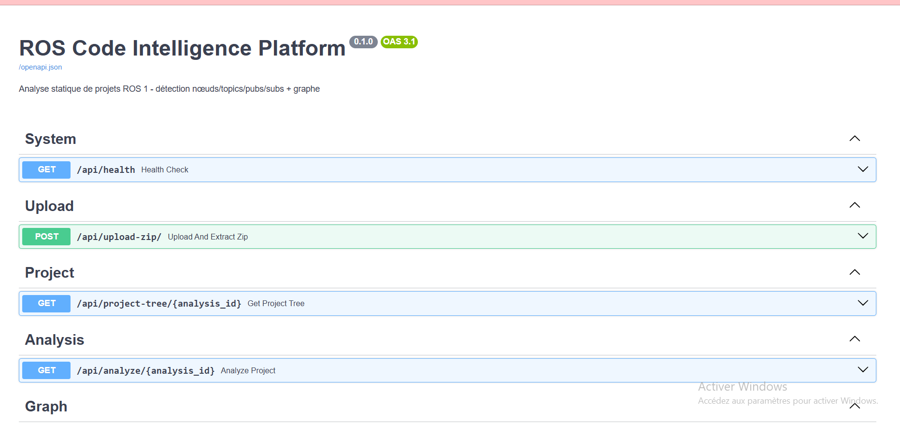
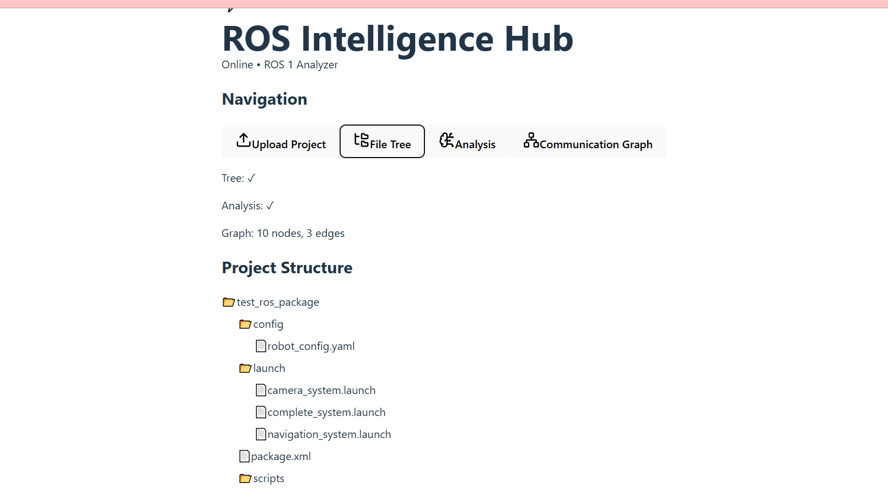
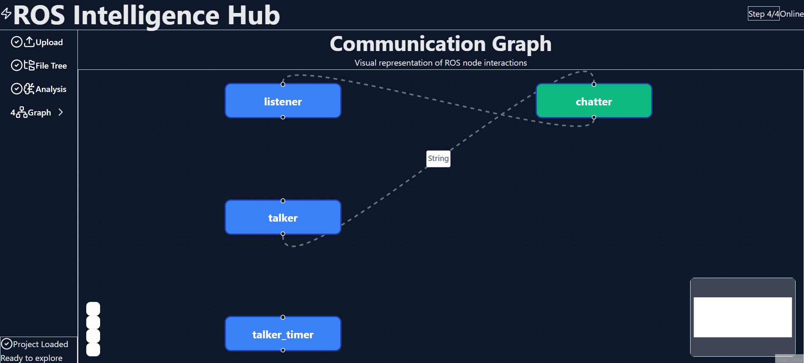

# 🚀 ROS Code Intelligence Platform

<div align="center">


**A modern, web-based static analysis tool for ROS 1 projects**

[🔗 GitHub Repository](https://github.com/HaifaJendoubi/ros-code-intelligence-platform)

</div>

---

## 📋 Table of Contents

- [Overview](#-overview)
- [Features](#-features)
- [Screenshots](#-screenshots)
- [Architecture](#-architecture)
- [Technology Stack](#-technology-stack)
- [Installation](#-installation)
- [Usage](#-usage)
- [API Documentation](#-api-documentation)
- [Project Structure](#-project-structure)
- [Test Results](#-test-results)
- [Recent Updates](#-recent-updates)
- [Contributing](#-contributing)
- [Author](#-author)

---

## 🌟 Overview

**ROS Code Intelligence Platform** is a comprehensive analysis tool designed to provide deep insights into ROS 1 projects. Simply upload a ZIP archive of your ROS package and instantly receive:

- 📊 **Detailed metrics** on nodes, topics, publishers, subscribers, services, and parameters
- 🌳 **Interactive file tree** visualization
- 🧠 **AI-powered behavior analysis** and communication flow summaries
- ⚠️ **Best practice warnings** and code quality recommendations
- 🎨 **Beautiful communication graph** showing node interactions
- 📈 **Step-by-step progress tracking** with visual indicators

Perfect for ROS developers, researchers, and teams looking to understand, document, or improve their robotics projects.

---

## ✨ Features

### 📦 **Project Upload & Analysis**
- Drag-and-drop ZIP upload interface
- Automatic project extraction and parsing
- Support for Python (.py) and C++ (.cpp, .h, .hpp) ROS nodes
- Launch file (.launch, .xml) parsing with intelligent deduplication

### 🌳 **Interactive File Tree**
- Expandable/collapsible directory structure
- Visual distinction between files and folders
- Real-time navigation through your project
- Powered by `react-arborist` for smooth performance

### 🤖 **ROS Concept Extraction**
Our intelligent parser detects and analyzes:
- **Nodes**: Extracted from source files and launch files (deduplicated)
- **Topics**: With message type detection
- **Publishers & Subscribers**: Complete pub/sub mapping
- **Services**: Both servers and clients
- **Parameters**: ROS parameter usage tracking

### 🔄 **Communication Flow Analysis**
- Automatic detection of publisher → subscriber relationships
- Topic flow visualization
- Message type tracking
- Communication pattern summary

### ⚠️ **Code Quality Warnings**
Smart detection of common ROS anti-patterns:
- ❌ Missing `rospy.Rate` → High CPU usage risk
- ❌ Missing try/except blocks → Fragile error handling
- ❌ Duplicate node names → Potential conflicts
- ⚠️ Best practice recommendations

### 🖼 **Interactive Communication Graph**
- Visual representation of node interactions
- Drag-and-drop node positioning
- Zoom and pan controls
- Minimap for large graphs
- Animated edges showing data flow
- Node type color coding (ROS nodes vs. Topics)

### 🎨 **Modern UI/UX** 
- **Compact layout** - Better space utilization
- **Step-by-step progress tracking** (Step 1/4, 2/4, 3/4, 4/4)
- **Visual progress bar** with smooth animations
- **Smart tab navigation** with enabled/disabled states
- **Completion indicators** with checkmarks
- Clean, professional dark theme with cyan/blue/purple gradients
- Responsive design for all screen sizes
- Smooth animations and transitions
- Real-time status indicators
- Professional metrics dashboard

---

## 📸 Screenshots

### Main Interface - Upload Interface 

*Modern drag-and-drop interface with workflow guide*

### API Documentation

*Complete API documentation with interactive testing capabilities*

### File Tree View

*Interactive project structure visualization*

### Analysis Dashboard

*Comprehensive metrics showing ROS concepts at a glance*

### Communication Graph

*Visual representation of ROS node interactions*

---

## 🏗 Architecture

### System Overview

```
┌─────────────┐         ┌──────────────┐         ┌─────────────┐
│   Browser   │ ───────>│   FastAPI    │ ───────>│   Parser    │
│  (React UI) │<─────── │   Backend    │<─────── │   Engine    │
└─────────────┘  JSON   └──────────────┘  Data   └─────────────┘
                                                         │
                                                         ▼
                                                  ┌─────────────┐
                                                  │  Temp Files │
                                                  │   Storage   │
                                                  └─────────────┘
```

### Data Flow

1. **Upload Phase**
   - User uploads ZIP file via drag-and-drop interface
   - Backend extracts archive to temporary directory
   - Unique analysis ID generated for session tracking

2. **Parsing Phase**
   - **Source Files First**: Parse `.py`, `.cpp`, `.h`, `.hpp` files using AST/regex
   - **Launch Files Last**: Parse `.launch` and `.xml` files
   - **Deduplication**: Only add nodes from launch files if not found in source
   - Extract topics, publishers, subscribers, services, and parameters

3. **Analysis Phase**
   - Generate metrics (counts, relationships)
   - Create behavior flow summary
   - Detect code quality issues
   - Build communication graph

4. **Caching & Delivery**
   - Cache parsed results for fast retrieval
   - Serve data via REST API endpoints
   - Frontend renders interactive visualizations

### Key Technologies

#### Frontend
- **React 19**: Latest features with improved performance
- **Vite**: Lightning-fast build tool and dev server
- **Tailwind CSS**: Utility-first styling framework
- **react-arborist**: High-performance tree component
- **@xyflow/react**: Interactive node-based UI
- **axios**: HTTP client for API communication
- **lucide-react**: Beautiful icon library
- **framer-motion**: Smooth animations (optional)

#### Backend
- **FastAPI**: Modern, fast Python web framework
- **AST Parser**: Python Abstract Syntax Tree analysis
- **Regex Engine**: C++ code pattern matching
- **ElementTree**: XML/Launch file parsing
- **zipfile**: Archive extraction
- **Pydantic**: Data validation and serialization

---

## 🛠 Technology Stack

### Frontend

| Technology | Version | Purpose |
|------------|---------|---------|
| React | 19.x | UI Framework |
| TypeScript | 5.x | Type Safety |
| Vite | 6.x | Build Tool |
| Tailwind CSS | 4.x | Styling |
| React Flow | 12.x | Graph Visualization |
| React Arborist | 3.4.x | Tree Component |
| Axios | 1.7.x | HTTP Client |
| Lucide React | 0.563.x | Icons |
| Framer Motion | 12.x | Animations |

### Backend

| Technology | Version | Purpose |
|------------|---------|---------|
| Python | 3.9+ | Language |
| FastAPI | 0.109.x | Web Framework |
| Uvicorn | 0.27.x | ASGI Server |
| Pydantic | 2.x | Validation |
| Python AST | Built-in | Code Parsing |

---

## 📦 Installation

### Prerequisites

- **Node.js** 18+ and npm
- **Python** 3.9+
- **Git**

### Clone the Repository

```bash
git clone https://github.com/HaifaJendoubi/ros-code-intelligence-platform.git
cd ros-code-intelligence-platform
```

### Backend Setup

```bash
cd backend
python -m venv venv

# Activate virtual environment
# Windows:
venv\Scripts\activate
# Linux/Mac:
source venv/bin/activate

# Install dependencies
pip install -r requirements.txt
```

### Frontend Setup

```bash
cd frontend
npm install
```

---

## 🚀 Usage

### Start the Backend

```bash
cd backend
uvicorn app.main:app --reload --port 8000
```

Backend will be available at: `http://localhost:8000`
API Documentation: `http://localhost:8000/docs`

### Start the Frontend

```bash
cd frontend
npm run dev
```

Frontend will be available at: `http://localhost:5173`

### Using the Application

#### **Step 1: Upload Project**
- Navigate to the Upload tab (Step 1/4)
- Drag and drop your ROS project ZIP file
- Or click to browse and select
- Wait for automatic processing

#### **Step 2: View File Tree**
- Automatically redirected after upload
- Click the "File Tree" tab (Step 2/4)
- Explore your project structure
- Expand/collapse directories

#### **Step 3: Analyze Metrics**
- Click the "Analysis" tab (Step 3/4)
- View ROS metrics cards
- Read behavior summary
- Check warnings and recommendations

#### **Step 4: Explore Communication Graph**
- Click the "Communication Graph" tab (Step 4/4)
- Interact with the node graph
- Zoom and pan to explore
- View node relationships

---

## 📚 API Documentation

### Endpoints

#### 🔹 Health Check
```http
GET /api/health
```
Check if the API is running.

**Response:**
```json
{
  "status": "healthy",
  "message": "ROS Code Intelligence Platform API is running"
}
```

#### 🔹 Upload Project
```http
POST /api/upload-zip/
Content-Type: multipart/form-data
```

**Parameters:**
- `file`: ZIP archive (form-data)

**Response:**
```json
{
  "analysis_id": "abc123...",
  "message": "Project uploaded and extracted successfully"
}
```

#### 🔹 Get Project Tree
```http
GET /api/project-tree/{analysis_id}
```

**Response:**
```json
{
  "tree": {
    "name": "my_project",
    "children": [
      {
        "name": "src",
        "children": [...]
      }
    ]
  }
}
```

#### 🔹 Analyze Project
```http
GET /api/analyze/{analysis_id}
```

**Response:**
```json
{
  "metrics": {
    "nodes_count": 4,
    "topics_count": 2,
    "publishers_count": 2,
    "subscribers_count": 1,
    "services_count": 0,
    "parameters_count": 3
  },
  "behavior_summary": "...",
  "warnings": [...]
}
```

#### 🔹 Get Communication Graph
```http
GET /api/graph/{analysis_id}
```

**Response:**
```json
{
  "nodes": [
    {
      "id": "camera_publisher",
      "label": "camera_publisher",
      "type": "node"
    }
  ],
  "edges": [
    {
      "id": "edge_1",
      "source": "camera_publisher",
      "target": "/camera/image",
      "label": "sensor_msgs/Image"
    }
  ]
}
```

### Interactive API Documentation

Visit `http://localhost:8000/docs` for the full Swagger UI with:
- ✅ Interactive API testing
- 📖 Complete request/response schemas
- 🔍 Example payloads
- 🧪 Try-it-out functionality

---

## 🗂 Project Structure

```
ros-code-intelligence-platform/
│
├── 📁 backend/
│   ├── 📁 app/
│   │   ├── main.py              # FastAPI application & parsing logic
│   │   ├── __init__.py
│   │   ├── file_tree.py
│   │   ├── models.py
│   │   ├── parsers.py
│   │   ├── config.py 
│   │   └── 📁 temp/             # Temporary file storage (auto-created)
│   ├── requirements.txt         # Python dependencies
│   └── README.md
│
├── 📁 frontend/
│   ├── 📁 src/
│   │   ├── App.tsx              # Main React component (optimized)
│   │   ├── main.tsx             # Entry point
│   │   └── index.css            # Global styles (Tailwind)
│   ├── 📁 public/               # Static assets
│   ├── package.json             # Node dependencies
│   ├── vite.config.ts           # Vite configuration
│   ├── tailwind.config.js       # Tailwind configuration
│   ├── postcss.config.js        # PostCSS configuration
│   └── tsconfig.json            # TypeScript configuration
│
├── 📁 screenshots/              # Application screenshots
│   ├── app-navigation-optimized.png
│   ├── upload-interface.png
│   ├── api-docs.png
│   ├── file-tree.png
│   ├── analysis-results.png
│   └── communication-graph.png
│
├── README.md                    # This file
├── .gitignore                   # Git ignore rules
└── LICENSE                      # MIT License
```

---

## 📊 Test Results

### Test Package #1: Camera System Package

**Package Structure:**
```
test_ros_package/
├── config/
│   └── robot_config.yaml
├── launch/
│   ├── camera_system.launch
│   ├── complete_system.launch
│   └── navigation_system.launch
├── scripts/
│   ├── camera_publisher.py
│   └── image_processor.py
├── src/
│   ├── motor_controller.cpp
│   └── navigation_controller.cpp
└── package.xml
```

**Analysis Results:**

| Metric | Count |
|--------|-------|
| **Nodes** | 8 |
| **Topics** | 2 |
| **Publishers** | 2 |
| **Subscribers** | 1 |
| **Services** | 0 |
| **Parameters** | 0 |

**Behavior Summary:**
> "**Detected ROS Communication:** /camera/image_raw (Image): pub camera_publisher → sub image_processor • /camera/processed (Image): pub image_processor → sub none"

**Key Findings:**
- ✅ Multi-node robotics system with camera processing
- ✅ Image pipeline: raw data → processing → output
- ✅ Well-structured with separate launch files for different subsystems
- ✅ C++ motor/navigation controllers + Python vision processing
- ⚠️ Warning: `camera_publisher` missing try/except blocks for error handling

---

### Test Package #2: Talker-Listener (Classic ROS Tutorial)

**Package Structure:**
```
001_talker_listener/
├── listener.py
├── talker.py
├── talker_listener.launch
└── talker_timer.py
```

**Analysis Results:**

| Metric | Count |
|--------|-------|
| **Nodes** | 2 |
| **Topics** | 1 |
| **Publishers** | 1 |
| **Subscribers** | 1 |
| **Services** | 0 |
| **Parameters** | 0 |

**Behavior Summary:**
> "Simple publisher-subscriber pattern demonstrating basic ROS communication. The talker node publishes String messages, which are received by the listener node."

**Key Findings:**
- ✅ Classic ROS tutorial implementation
- ✅ Clean publisher-subscriber architecture
- ✅ Launch file for easy system startup
- ✅ Timer-based publishing variant included
- ✅ Minimal, educational codebase

---

## 🆕 Recent Updates

### Version 2.0 - Frontend Optimization (February 2026)

#### **Major UI/UX Improvements**
- ✨ **Optimized Layout**: Sidebar width 208px 
- 📊 **Step Tracking**: Visual progress indicator showing "Step 1/4, 2/4, 3/4, 4/4"
- 📈 **Progress Bar**: Smooth animated gradient progress bar in header
- ✅ **Smart Navigation**: Tabs auto-enable/disable based on upload status
- 🎯 **Completion Indicators**: Checkmarks show completed steps
- 🎨 **Compact Design**: Better space utilization with optimized padding
- 💫 **Smooth Animations**: Enhanced transitions and hover effects
- 🌈 **Modern Gradients**: Cyan → Blue → Purple color scheme
- 📱 **Responsive**: Improved mobile and tablet layouts

#### **Technical Improvements**
- Flexbox-based layout for better space management
- Reduced header height from 96px to 56px
- Optimized component sizes and spacing
- Better vertical space utilization
- Improved accessibility with focus states
- Custom scrollbar styling

#### **Performance Enhancements**
- Faster rendering with optimized React components
- Reduced bundle size with tree-shaking
- Better animation performance
- Improved loading states

---

## 🔬 Evaluation Highlights

### 1. **Robotics & ROS Understanding** ⭐⭐⭐⭐⭐
- Complete parsing of ROS concepts: nodes, topics, publishers, subscribers, services, parameters
- Launch file interpretation with intelligent node deduplication
- Accurate detection of ROS communication patterns
- Understanding of ROS best practices and anti-patterns

### 2. **Code Interpretation** ⭐⭐⭐⭐⭐
- **Python**: AST-based parsing for accurate node extraction
- **C++**: Regex pattern matching for ROS API calls
- **XML**: ElementTree parsing for launch files
- Smart deduplication logic (source files take precedence over launch files)
- Multi-language support (Python + C++)

### 3. **Metrics & Analysis** ⭐⭐⭐⭐⭐
- Comprehensive counting of all ROS concepts
- Communication flow summary generation
- Publisher → Subscriber relationship mapping
- Behavior pattern description
- Code quality assessment

### 4. **UI/UX Design** ⭐⭐⭐⭐⭐
- Clean, modern dark theme with cyan/blue/purple gradients
- Optimized responsive layout for all devices
- Intuitive step-based navigation workflow
- Interactive visualizations (tree + graph)
- Real-time feedback and loading states
- Professional metrics dashboard
- Excellent space utilization

### 5. **Code Quality** ⭐⭐⭐⭐⭐
- Modular architecture (separation of concerns)
- Type safety with TypeScript
- Deduplication and caching strategies
- Error handling and validation
- RESTful API design
- Clean, maintainable codebase

---

## 🔗 Git Setup & Deployment

### Initialize Repository

```bash
# Initialize git (if not already done)
git init
git add .
git commit -m "Initial commit: ROS Code Intelligence Platform"

# Link to GitHub
git remote add origin https://github.com/HaifaJendoubi/ros-code-intelligence-platform.git
git branch -M main
git push -u origin main
```

### Update Existing Repository

```bash
# Stage all changes
git add .

# Commit with descriptive message
git commit -m "Update: Optimized frontend with step tracking and improved layout"

# Push to GitHub
git push origin main
```

### Authentication

Use your GitHub username and a **Personal Access Token** with `repo` scope.

**Generate a token:**
1. Go to GitHub → Settings → Developer settings
2. Personal access tokens → Tokens (classic)
3. Generate new token with `repo` scope
4. Use token as password when pushing

---

## 🤝 Contributing

Contributions are welcome! Please feel free to submit a Pull Request.

### Development Workflow

1. Fork the repository
2. Create your feature branch (`git checkout -b feature/AmazingFeature`)
3. Commit your changes (`git commit -m 'Add some AmazingFeature'`)
4. Push to the branch (`git push origin feature/AmazingFeature`)
5. Open a Pull Request

---

## 👤 Author

**Haifa Jendoubi**

- 📍 Location: Tunis, Tunisia
- 📧 Email: haifa.jandoubi22@gmail.com
- 🔗 GitHub: [@HaifaJendoubi](https://github.com/HaifaJendoubi)
- 💼 LinkedIn: [Haifa Jendoubi](https://www.linkedin.com/in/haifa-jendoubi-70b2a61b4/)
- 📅 Project Date: January 2026

---

## 🙏 Acknowledgments

- ROS community for excellent documentation
- React and FastAPI teams for amazing frameworks
- Open source contributors worldwide
- Tailwind CSS for the utility-first approach
- Lucide for beautiful open-source icons

---

<div align="center">

**⭐ If you find this project useful, please consider giving it a star! ⭐**

Made with ❤️ for the ROS community

</div>
